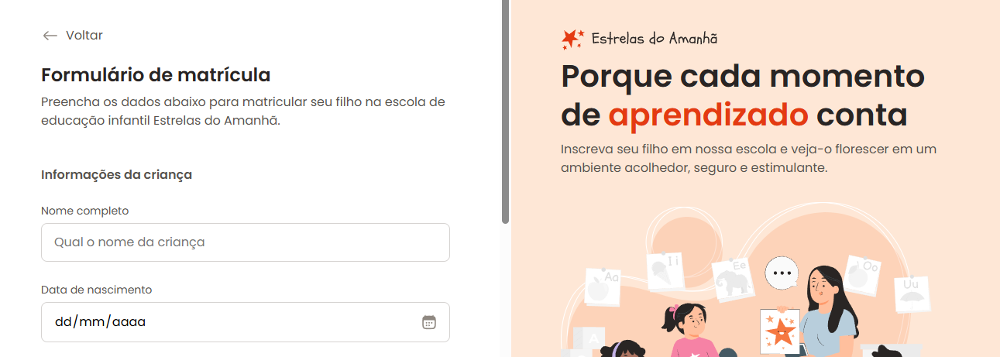

# Formulário de matrícula

Esse projeto foi desenvolvido após as aulas sobre formulários, com o intuito de praticar os conceitos aprendidos.

## Executando

Após clonar o repositório, acesse a pasta do projeto e abra o arquivo `index.html`, ou então, no próprio GitHub clique no link abaixo da seção **About**.
